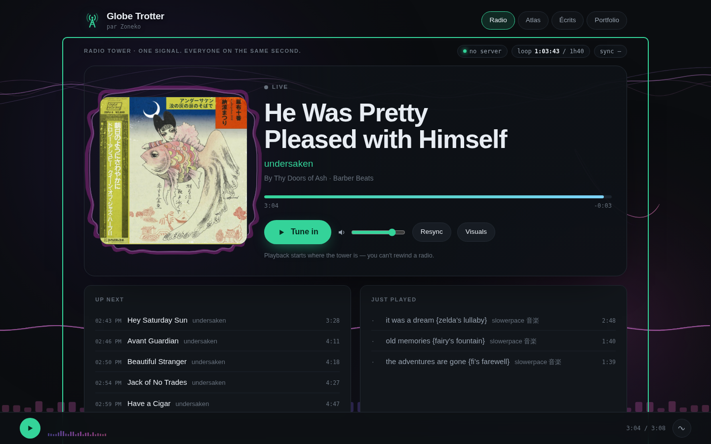
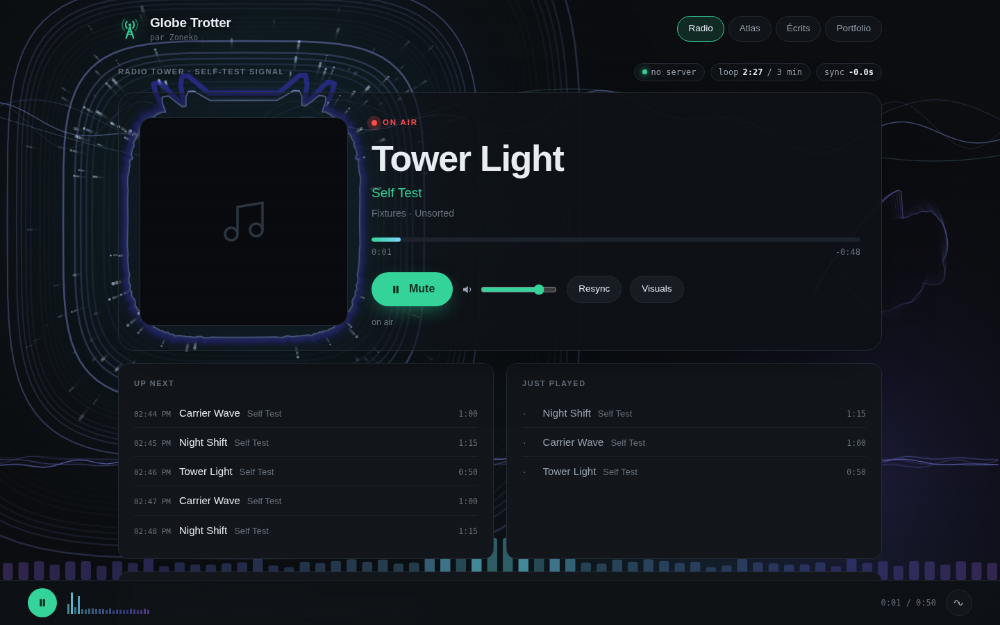
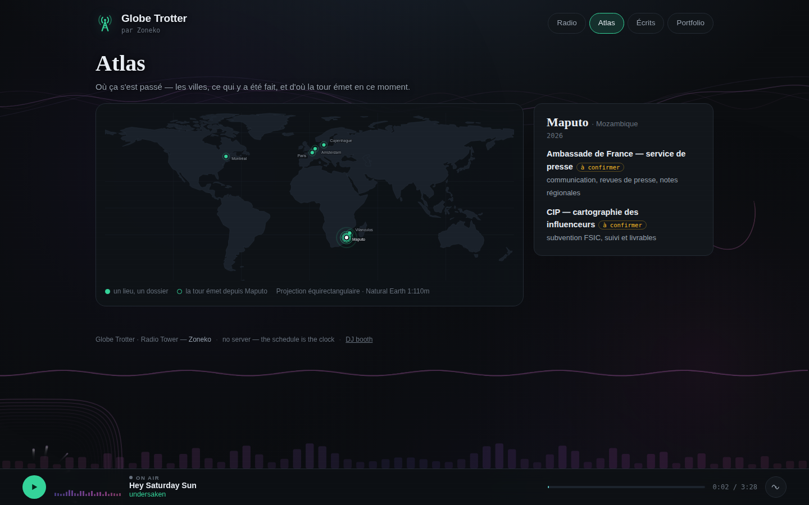
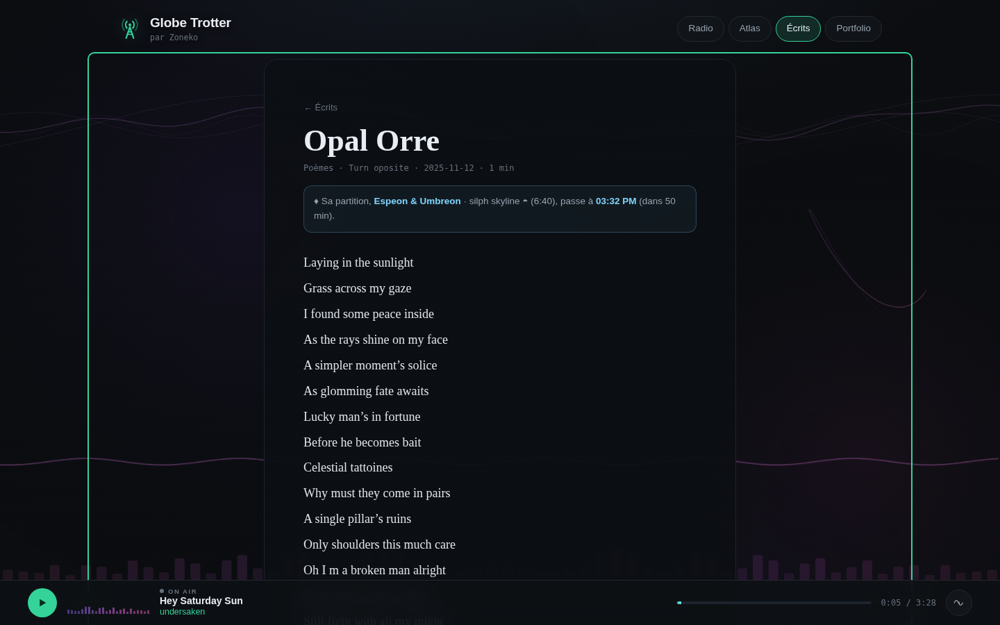
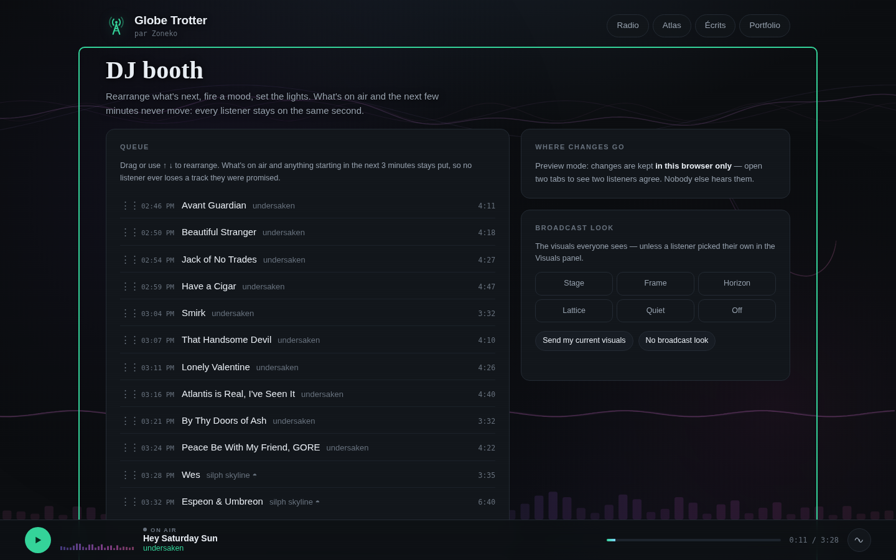
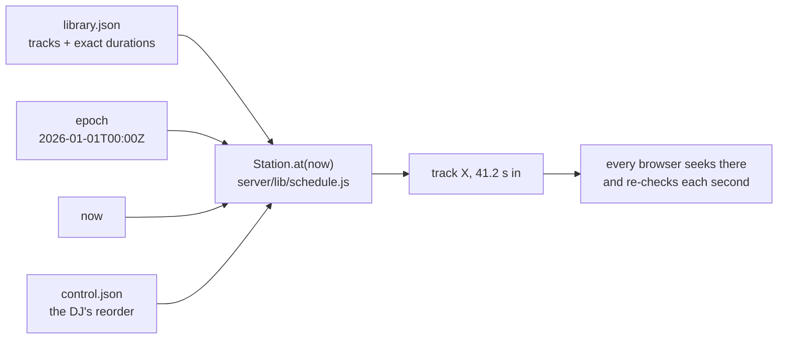

# Radio Tower · Globe Trotter

**One signal. Everyone on the same second.**

A radio station where every listener hears the same track at the same second —
no account, no app, one button — inside a small personal site by **Zoneko**: an
atlas of where things were made, a shelf of writing, and a portfolio.

It runs two ways, from the same code:

- **In the cloud, with no server at all.** A static site on GitHub Pages. Every
  visitor's browser *is* the station: it computes what is on air from the
  library, a fixed epoch and the clock. The DJ's decisions live in one small
  JSON file in this repository.
- **On a Raspberry Pi** (the original build): an Express server streaming a
  whole MP3 library, reachable anywhere through a Cloudflare Tunnel.



<table><tr>
<td></td>
<td></td>
</tr><tr>
<td></td>
<td></td>
</tr></table>

## What's on the site

| | |
|---|---|
| **Radio** | On air, Up next / Just played, the programme for the next hours, and the queue. A **full-page visualiser** — nine layers (bloom, horizon, harmonics, spectrum, phase weave, ring, dispersal, shock, ribbon) on one canvas — with a **Visuals** panel for every listener (<kbd>V</kbd>; <kbd>F</kbd> for full screen, <kbd>M</kbd> to tune in or mute). |
| **Atlas** | A world map, no map library and no tiles: the places where work was made, and the tower's own broadcast point pulsing in the logo's sideways waves. |
| **Écrits** | The Globe Trotter texts, verbatim. Three are *scored* by a track in the rotation; the page tells you when the score is next on air. |
| **Portfolio** | The Library (essays, the thesis, the network-map room), Photos, and Crates (the albums the tower plays, with when each is next on air). |
| **DJ booth** | Rearrange what's next, fire a *Spontaneous Emission* ("play this mood now"), or set the broadcast look everyone sees. |

The music keeps playing while you move between pages — the site is a
single-page app with one `<audio>` element that never reloads.

## How everyone stays on the same second



The programme is a **pure function of wall-clock time**
([`docs/ARCHITECTURE.md`](docs/ARCHITECTURE.md)). Nothing stores what is
playing. The same `Station` class runs on the Pi and — copied verbatim — in the
browser, so two visitors on two continents agree without ever talking to each
other. The player corrects a wrong device clock and re-seeks past two seconds
of drift.

**The queue** is the one shared, changing thing. A reorder is a *permutation*
of upcoming tracks beyond a three-minute fence: it cannot change the length of
the loop, so nothing outside the window moves and nobody desyncs. In the cloud
the booth commits `site/station/control.json` through the GitHub API (with a
token that never leaves the DJ's browser); listeners pick it up within about a
minute. Details: [`docs/CLOUD.md`](docs/CLOUD.md).

## Run it

```bash
npm install
npm run site                       # the static site on http://localhost:8090
npm run site -- --fixtures DIR     # …playing DIR/*.mp3 instead of the real library
```

The Pi / server version:

```bash
MUSIC_DIR=/path/to/your/mp3s npm start      # http://localhost:8080
```

Point the static site at a running server and it uses that instead of
computing locally — full library, live listener count:
`http://localhost:8090/radio?tower=http://localhost:8080`.

## Put it on the web

**[`docs/GO-LIVE.md`](docs/GO-LIVE.md)** — create the repository, push, turn on
Pages, give the booth a token. About five minutes. After that every push
redeploys (`.github/workflows/pages.yml`), and every push is tested
(`.github/workflows/ci.yml`).

On a Raspberry Pi instead: [`pi/README.md`](pi/README.md) from a blank SD card,
[`pi/anywhere/README.md`](pi/anywhere/README.md) to keep it online on any
network and your own domain.

## The self-test

```bash
bash scripts/build-test.sh
```

Unit and integration tests, a real server against generated audio, the whole
HTTP surface, schedule determinism across thousands of instants, the Pi player
in headless Chromium — and the static site in a real browser: two listeners on
the same second, music across page changes, the visualiser covering the page, a
booth reorder committed and adopted by a second listener, a 390 px phone, the
built site under a repository sub-path, and the same front end against a real
server. Exit 0 means the tower is sound.

## Layout

```
site/             the static site — plain HTML/CSS/ES modules, no bundler
  station/          library.json (the cloud channel), control.json (the DJ), moods.json
  js/engine/        the station in the browser, the control planes, cloud|tower transport
  js/viz/           the full-page visualiser and its settings
  js/pages/         seuil, radio, atlas, ecrits, portfolio (+ rooms/), booth
server/           the Express station; lib/schedule.js is the heart of both
public/           the Pi's original player pages
collections/      the portfolio's content and its manifest
writing/          the Globe Trotter texts, verbatim
scripts/          self-test, site build/serve/smoke, Pi tooling
pi/  deploy/      Raspberry Pi installer, networking, tunnel
dj/               the DJ booth as a CLI
docs/             architecture, the cloud plan, decisions, roadmap, worklog
.github/          CI and the Pages deploy
.claude/          the agents, skills and commands that build this project
```

## Rules this project keeps

- **No accounts, no tracking, no cookies.** Open a URL, hear music.
- **No build step on the front end.** `scripts/site-build.mjs` copies files; it never bundles.
- **Never commit audio.** The cloud channel links to files already hosted; the Pi reads `MUSIC_DIR`.
- **Green before, green after.** Don't weaken a test to make a change pass.
- Decisions and their reasons: [`docs/DECISIONS.md`](docs/DECISIONS.md). What each run did: [`docs/WORKLOG.md`](docs/WORKLOG.md).

The music belongs to its artists (slowerpace 音楽, undersaken, silph skyline ◓,
snowpoint lounge, A4, …). This repository contains no audio: the cloud channel
links to copies already on Zoneko's own Wix media, and the Pi reads a local
folder.

Site and writing © Zoneko.
